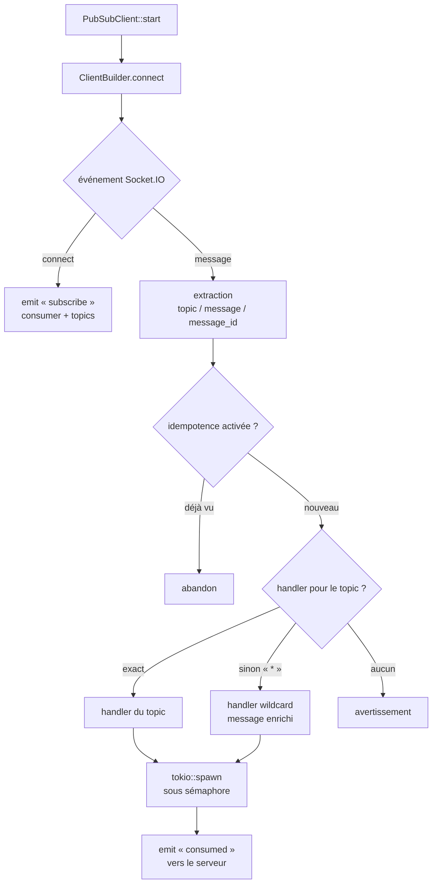

# Claude.md — Rust-PubSub-Client

## Préférences de travail

Réponses concises, sans verbiage. Code efficace avant tout.
Commentaires et documentation **en français, avec les accents**.
Les schémas se font en **Mermaid** — jamais de diagrammes ASCII.

## Ce qu'est ce dépôt

Client Rust asynchrone pour `Rust-PubSub-Server` : abonnement Socket.IO, distribution des
messages vers des handlers par topic, publication en HTTP, filtre d'idempotence optionnel.

- `client.rs` — `PubSubClient` : connexion, abonnement, routage vers les handlers
- `config.rs` — `ClientConfig`, réglable par variables d'environnement `PUBSUB_*`
- `idempotence.rs` — filtre FIFO des `message_id` déjà vus
- `message.rs` — `PubSubMessage` (topic, message_id, message, producer)

## Architecture



## Invariants à ne pas casser

- **`should_process` a un effet de bord** : elle enregistre l'identifiant en plus de répondre.
  Sa sémantique d'éviction est **FIFO stricte** — les tests `test_idempotence_capacity`
  en dépendent (avec `max_size = 3`, après `id1..id4`, `id1` est réadmis et `id4` refusé).
- **Le filtre d'idempotence est sur le chemin critique** : recherche en O(1) obligatoire
  (index `HashSet` doublé d'une `VecDeque` pour l'ordre), pas de balayage linéaire ni
  d'allocation par appel.
- **`consumed` doit porter le vrai nom du consommateur**, pas le nom du handler : le serveur
  agrège les consommateurs à partir de cet événement, et un nom de handler crée un nœud
  fantôme dans le graphe du dashboard.
- **`reconnection_attempts = 0` désactive la reconnexion** côté `rust_socketio` : à ne pas
  confondre avec « illimité ».

## Commandes

```bash
cargo build
cargo test
cargo clippy --all-targets
cargo bench                          # criterion
cargo run --example simple_client
cargo run --example wildcard_handler
```

## Variables d'environnement

| Variable | Défaut | Rôle |
| --- | --- | --- |
| `PUBSUB_RECONNECTION_ENABLED` | `true` | Active la reconnexion automatique |
| `PUBSUB_RECONNECTION_ATTEMPTS` | `10` | Nombre de tentatives (plafonné à 255) |
| `PUBSUB_RECONNECTION_DELAY_MS` | `2000` | Délai initial entre deux tentatives |
| `PUBSUB_RECONNECTION_DELAY_MAX_MS` | `10000` | Délai maximal |
